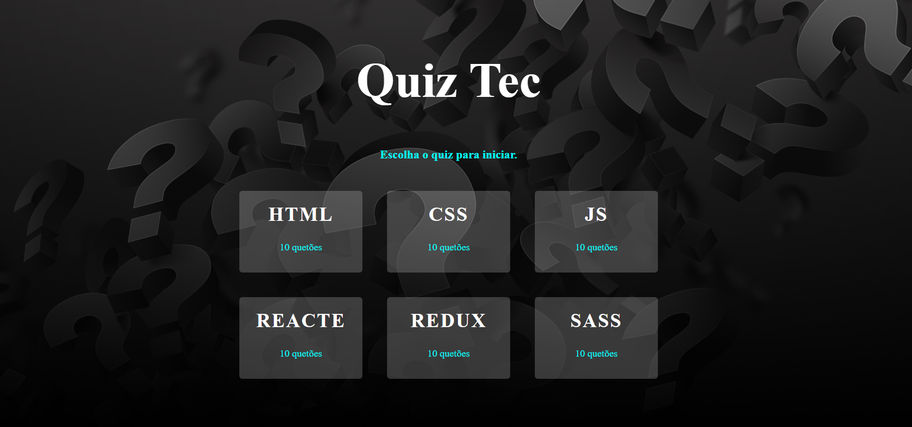
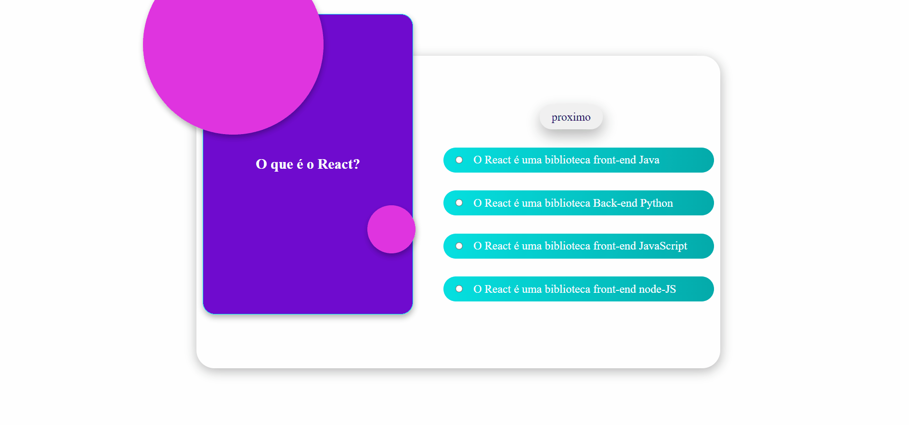
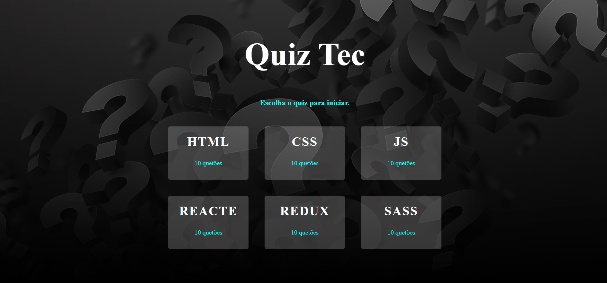

# Readme

 <h2 align="center">Quiz Tec</h2>

Projeto Quiz de tecnologias para você aprimorar seus conhecimentos técnicos.

 

<h2 align="center">About</h2> 

Neste projeto utilizei diversas técnicas com:

- [Variaveis. ]()
- [Functions.]()
- [Arreys.]()
- [Objects.]()
- [Loops.]()
- [Condicionais.]()
- [eventos.]()
- [manipulação do DOM.]()
- [Arrow function.]()
- [Template string.]()

 

## Tabela de conteudo

- [Gifs](#gifs)
- [Tecnologia utilizada](#tecnologias)
- [Como utilizar](#utilização)
- [Veja o projeto funcionando.](#funcionando)

   

   <h4 align="center">&#11088 Quiz Tec &#11088 </h4>
    

### Características

- [x] Sistemas de verificação.
- [x] Responsivo.
- [x] Grid Layout.

  
 

  

## Gifs

<h2>Sistemas de verificação</h2>  
      
    <h2> Responsivo.</h2> 
       
      
     
        <h2> Prejeto funcionando.</h2> 
       
 

 
 

 
 ## Tecnologias 
 
 <h2>utilizada</h2> 

- HTML 
- CSS 
- JavaScript 

 

 

## Utilização

Projeto usando apenas tecnologias de fácil utilização não necessita nenhuma instalação.

 

 

   
 

  

## Funcionando

  
Click no botão abaixo e visualize o projeto 

 
  <button  style="padding:8px 20px; border-radius:5px; border:none; background:black;"><a style="color:aqua;" target="_blank" href="https://fernandoroch.github.io/Quiz-Tec/">Ir para projeto</a>
  </button>
  

   
 

  

### Criado por fernando rocha.

Rede Sociais:

- <a target="_blank"  href="https://www.linkedin.com/feed/?trk=404_page">linkedin</a>
- <a target="_blank"  href="https://www.instagram.com/_daycode_/">Instagram</a>
- <a target="_blank"  href="https://www.tiktok.com/@_daycode_">TikTok</a>
